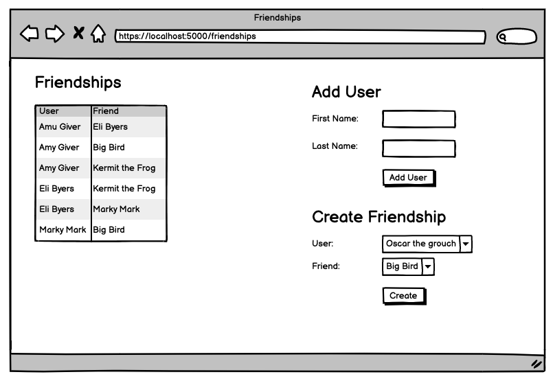

# Friendships CRUD
This is a fullstack web-app CRUD module built with Flask and MySQL involving many-to-many relationships.
### Objectives:
* Create a new Flask project
* Create a new MySQL schema
* Display all of the the friendships create in the table
* Have a form to add a new user
* Have a form with 2 drop downs, each containing all of the users in the dB
* Redirect to `/friendships` after creating a new user or friendship
* Do not allow a user : friend connection more than once
## I was given this wireframe as a reference:

